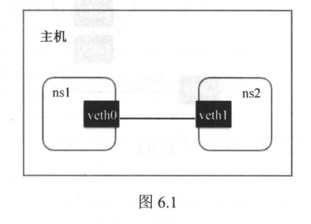
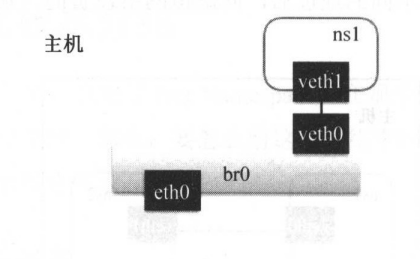
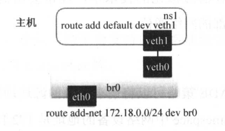

介绍容器相关的虚拟网络，如veth、bridge、路由表、iptables
<!--more-->

---

# 第六章 容器网络

## 1. Linux 虚拟网络设备

### Linux Veth

#### veth-pair

顾名思义，veth-pair 就是一对的虚拟设备接口，和 tap/tun 设备不同的是，它都是成对出现的。一端连着协议栈，一端彼此相连着。

一般用于跨 namespace 通信。

> Linux 中默认不同 net namespace 设备无法通信。

#### 网络命名空间

为了支持网络协议栈的多个实例，Linux在网络栈中引入了网络命名空间。这些独立的协议栈被隔离到不同的命名空间中。

处理不同网络命令空间中的通信

​​

#### Demo

本次演示中，先创建一个网络命名空间，然后创建一个 veth 设备对，将设备对分别切换到不同的命名空间中，实现不同命名空间的互相通信。

准备一个 net namespace

```shell
root@pjm2001:~# ip netns add netns1
root@pjm2001:~# ip netns list
netns1
root@pjm2001:~#
```

创建两个Veth设备对(`ip link add <veth name> type veth peer name <peer>`​)

```shell
root@pjm2001:~# ip link add veth0 type veth peer name veth1
root@pjm2001:~# ip link show
1: lo: <LOOPBACK,UP,LOWER_UP> mtu 65536 qdisc noqueue state UNKNOWN mode DEFAULT group default qlen 1000
    link/loopback 00:00:00:00:00:00 brd 00:00:00:00:00:00
2: eth0: <BROADCAST,MULTICAST,UP,LOWER_UP> mtu 1500 qdisc mq state UP mode DEFAULT group default qlen 1000
    link/ether 00:15:5d:c4:21:04 brd ff:ff:ff:ff:ff:ff
3: veth1@veth0: <BROADCAST,MULTICAST,M-DOWN> mtu 1500 qdisc noop state DOWN mode DEFAULT group default qlen 1000
    link/ether aa:ed:e3:6e:27:4b brd ff:ff:ff:ff:ff:ff
4: veth0@veth1: <BROADCAST,MULTICAST,M-DOWN> mtu 1500 qdisc noop state DOWN mode DEFAULT group default qlen 1000
    link/ether fe:2a:a9:3a:08:af brd ff:ff:ff:ff:ff:ff
root@pjm2001:~#
```

此时两个 veth 都在默认 net namespace 中，为了测试，先将其中一个切换到 netns1

```shell
root@pjm2001:~# ip link set veth1 netns netns1
root@pjm2001:~# ip link show
1: lo: <LOOPBACK,UP,LOWER_UP> mtu 65536 qdisc noqueue state UNKNOWN mode DEFAULT group default qlen 1000
    link/loopback 00:00:00:00:00:00 brd 00:00:00:00:00:00
2: eth0: <BROADCAST,MULTICAST,UP,LOWER_UP> mtu 1500 qdisc mq state UP mode DEFAULT group default qlen 1000
    link/ether 00:15:5d:c4:21:04 brd ff:ff:ff:ff:ff:ff
4: veth0@if3: <BROADCAST,MULTICAST> mtu 1500 qdisc noop state DOWN mode DEFAULT group default qlen 1000
    link/ether fe:2a:a9:3a:08:af brd ff:ff:ff:ff:ff:ff link-netns netns1
root@pjm2001:~# ip netns exec netns1 ip link show
1: lo: <LOOPBACK> mtu 65536 qdisc noop state DOWN mode DEFAULT group default qlen 1000
    link/loopback 00:00:00:00:00:00 brd 00:00:00:00:00:00
3: veth1@if4: <BROADCAST,MULTICAST> mtu 1500 qdisc noop state DOWN mode DEFAULT group default qlen 1000
    link/ether aa:ed:e3:6e:27:4b brd ff:ff:ff:ff:ff:ff link-netnsid 0
root@pjm2001:~#
```

至此，两个不同的命名空间各自有一个Veth，不过还不能通信，因为我们还没给它们分配IP

```shell
root@pjm2001:~# ip netns exec netns1 ip addr add 10.1.1.1/24 dev veth1
root@pjm2001:~# ip addr add 10.1.1.2/24 dev veth0
root@pjm2001:~#
```

再启动它们

```shell
root@pjm2001:~# ip netns exec netns1 ip link set dev veth1 up
root@pjm2001:~# ip link set dev veth0 up
root@pjm2001:~#
```

现在两个网络命名空间可以互相通信了

```shell
root@pjm2001:~# ping 10.1.1.1
PING 10.1.1.1 (10.1.1.1) 56(84) bytes of data.
64 bytes from 10.1.1.1: icmp_seq=1 ttl=64 time=0.166 ms
64 bytes from 10.1.1.1: icmp_seq=2 ttl=64 time=0.053 ms
64 bytes from 10.1.1.1: icmp_seq=3 ttl=64 time=0.051 ms
^C
--- 10.1.1.1 ping statistics ---
3 packets transmitted, 3 received, 0% packet loss, time 2077ms
rtt min/avg/max/mdev = 0.051/0.090/0.166/0.053 ms
root@pjm2001:~#
```

至此，Veth设备对的基本原理和用法演示结束。

> Docker 内部，Veth设备对也是连通容器与宿主机的主要网络设备。

#### 查看对端设备

由于 Veth 设备对被移动到另一个命名空间后在当前命名空间中就看不到了。

那么该如何知道这个Veth设备的另一端在哪儿呢？

可以使用 ethtool 工具来查看：

```shell
root@pjm2001:~# ip netns exec netns1 ethtool -S veth1
NIC statistics:
     peer_ifindex: 4
     rx_queue_0_xdp_packets: 0
     rx_queue_0_xdp_bytes: 0
     rx_queue_0_drops: 0
     rx_queue_0_xdp_redirect: 0
     rx_queue_0_xdp_drops: 0
     rx_queue_0_xdp_tx: 0
     rx_queue_0_xdp_tx_errors: 0
     tx_queue_0_xdp_xmit: 0
     tx_queue_0_xdp_xmit_errors: 0
root@pjm2001:~#
```

peer_ifindex 就是另一端的接口设备的序列号，这里是 4。

然后在到默认命名空间取看 序列化4代表的是什么设备：

```shell
root@pjm2001:~# ip link | grep ^4
4: veth0@if3: <BROADCAST,MULTICAST,UP,LOWER_UP> mtu 1500 qdisc noqueue state UP mode DEFAULT group default qlen 1000
root@pjm2001:~#
```

可以看到 序列号4的设备就是 veth0，它的另一端就是 netns1 中的 veth1，它们互为 peer。

### Linux Bridge

Bridge 虚拟设备是用来桥接的网络设备，它相当于现实世界中的交换机，可以连接不同的网络设备，当请求到达 Bridge 设备时，可以通过报文中的 Mac 地址进行广播或转发。

例如，我们可以创建一个 Bridge 设备来连接 Namespace 中的网络设备和宿主机上的网络。

```shell
root@pjm2001:~# ip netns add ns1
root@pjm2001:~# ip link add veth0 type veth peer name veth1
root@pjm2001:~# ip link set veth1 netns ns1
root@pjm2001:~# ip link
1: lo: <LOOPBACK,UP,LOWER_UP> mtu 65536 qdisc noqueue state UNKNOWN mode DEFAULT group default qlen 1000
    link/loopback 00:00:00:00:00:00 brd 00:00:00:00:00:00
2: eth0: <BROADCAST,MULTICAST,UP,LOWER_UP> mtu 1500 qdisc mq state UP mode DEFAULT group default qlen 1000
    link/ether 00:15:5d:c4:21:04 brd ff:ff:ff:ff:ff:ff
7: veth0@if6: <BROADCAST,MULTICAST> mtu 1500 qdisc noop state DOWN mode DEFAULT group default qlen 1000
    link/ether 1e:f3:a4:95:47:79 brd ff:ff:ff:ff:ff:ff link-netns ns1
root@pjm2001:~# brctl addbr br0
root@pjm2001:~# brctl addif br0 eth0
root@pjm2001:~# brctl addif br0 veth0
root@pjm2001:~# brctl show br0
bridge name     bridge id               STP enabled     interfaces
br0             8000.00155dc42104       no              eth0
                                                        veth0
root@pjm2001:~#
```

[linux bridge实践](https://zhuanlan.zhihu.com/p/339070912)

​​

## 2. Linux 路由表

路由表是 Linux 内核的一个模块，通过定义路由表来决定在某个网络Namespace 中包的流向，从而定义请求会到哪个网络设备上。

​​

继续以上面的例子演示

```shell
# 启动宿主机上的虚拟网络设备，
root@pjm2001:~# ip link set veth0 up
root@pjm2001:~# ip link set br0 up
# 给ns1中的虚拟网络设备设置IP并启动它
root@pjm2001:~# ip netns exec ns1 ip addr add 172.18.0.2/24 dev veth1
root@pjm2001:~# ip netns exec ns1 ip link set dev veth1 up
root@pjm2001:~# ip netns exec ns1 ip link show veth1
6: veth1@if7: <BROADCAST,MULTICAST,UP,LOWER_UP> mtu 1500 qdisc noqueue state UP mode DEFAULT group default qlen 1000
    link/ether 16:94:1d:b5:77:bf brd ff:ff:ff:ff:ff:ff link-netnsid 0
# 分别设置ns1网络空间的路由和宿主机上的路由
# default代表0.0.0.0/0,即在Net Namespace中的所有流量都经过veth1的网络设备流出
root@pjm2001:~# ip netns exec ns1 route add default dev veth1
# 在宿主机上将172.18.0.0/24网段的请求路由到br0网桥
root@pjm2001:~# route add -net 172.18.0.0/24 dev br0
root@pjm2001:~#
```

通过设置路由，对IP地址的请求就能正确被路由到对应的网络设备上，从而实现通信，如下：

```shell
# 查看宿主机的IP地址
root@pjm2001:~# ip addr show eth0
2: eth0: <BROADCAST,MULTICAST,UP,LOWER_UP> mtu 1500 qdisc mq master br0 state UP group default qlen 1000
    link/ether 00:15:5d:c4:21:04 brd ff:ff:ff:ff:ff:ff
    inet 172.23.52.96/20 brd 172.23.63.255 scope global eth0
       valid_lft forever preferred_lft forever
    inet6 fe80::215:5dff:fec4:2104/64 scope link
       valid_lft forever preferred_lft forever
# 从Namespace中访问宿主机的地址
root@pjm2001:~# ip netns exec ns1 ping -c 1 172.23.52.96
PING 172.23.52.96 (172.23.52.96) 56(84) bytes of data.
64 bytes from 172.23.52.96: icmp_seq=1 ttl=64 time=0.053 ms

--- 172.23.52.96 ping statistics ---
1 packets transmitted, 1 received, 0% packet loss, time 0ms
rtt min/avg/max/mdev = 0.053/0.053/0.053/0.000 ms
root@pjm2001:~#
# 从宿主机访问Namespace中的网络地址
root@pjm2001:~# ip netns exec ns1 ip addr show veth1
6: veth1@if7: <BROADCAST,MULTICAST,UP,LOWER_UP> mtu 1500 qdisc noqueue state UP group default qlen 1000
    link/ether 16:94:1d:b5:77:bf brd ff:ff:ff:ff:ff:ff link-netnsid 0
    inet 172.18.0.2/24 scope global veth1
       valid_lft forever preferred_lft forever
    inet6 fe80::1494:1dff:feb5:77bf/64 scope link
       valid_lft forever preferred_lft forever
root@pjm2001:~# ping -c 1 172.18.0.2
PING 172.18.0.2 (172.18.0.2) 56(84) bytes of data.
64 bytes from 172.18.0.2: icmp_seq=1 ttl=64 time=0.050 ms

--- 172.18.0.2 ping statistics ---
1 packets transmitted, 1 received, 0% packet loss, time 0ms
rtt min/avg/max/mdev = 0.050/0.050/0.050/0.000 ms
root@pjm2001:~#
```

到此就实现了通过网桥连接不同Namespace网络了。

## 3. Linux iptables

iptables 是对 Linux 内核的 netfilter 模块进行操作和展示的工具，用来管理包的流动和转送。iptables 定义了一套链式处理的结构，在网络包传输的各个阶段可以使用不同的策略对包进行加工、传送或丢弃。

在容器虚拟化的技术中，经常会用到两种策略 MASQUERADE 和 DNAT，用于容器和宿主机外部的网络通信。

### MASQUERADE

iptables 中的 MASQUERADE 策略可以将请求包中的源地址转换成一个网络设备的地址。

比如上述例子中的那个 Namespace 中网络设备的地址是 172.18.0.2, 这个地址虽然在宿主机上可以路由到 br0 网桥，但是到达宿主机外部之后，是不知道如何路由到这个 IP 地址的，所以如果要请求外部地址的话，需要先通过MASQUERADE 策略将这个 IP 转换成宿主机出口网卡的 IP。

```shell
# 打开IP转发
root@pjm2001:~# sysctl -w net.ipv4.conf.all.forwarding=1
net.ipv4.conf.all.forwarding = 1
# 对Namespace中发出的包添加网络地址转换
root@pjm2001:~# iptables -t nat -A POSTROUTING -s 172.18.0.0/24 -o eth0 -j MAS
QUERADE
root@pjm2001:~#
```

在 Namespace 中请求宿主机外部地址时，将 Namespace 中的源地址转换成宿主机的地址作为源地址，就可以在 Namespace 中访问宿主机外的网络了。

### DNAT

iptables 中的 DNAT 策略也是做网络地址的转换，不过它是要更换目标地址，经常用于将内部网络地址的端口映射到外部去。

比如，上面那个例子中的 Namespace 如果需要提供服务给宿主机之外的应用去请求要怎么办呢?

外部应用没办法直接路由到 172.18.0.2 这个地址，这时候就可以用到 DNAT 策略。

```shell
# 将宿主机上80端口的请求转发到Namespace里的IP上
root@pjm2001:~# iptables -t nat -A PREROUTING -p tcp -m tcp --dport 80 -j DNAT --to-destination 172.18.0.2:80
root@pjm2001:~#
```

这样就可以把宿主机上 80 端口的 TCP 请求转发到 Namespace 中的地址172.18.0.2:80,从而实现外部的应用调用。

‍
## 4. 结尾
做完上述实验之后，记得恢复网络设置。
```shell
root@pjm2001:~# ip link delete veth0
root@pjm2001:~# ip link delete br0
root@pjm2001:~# ping github.com
PING github.com (20.205.243.166) 56(84) bytes of data.
64 bytes from 20.205.243.166 (20.205.243.166): icmp_seq=1 ttl=100 time=236 ms
64 bytes from 20.205.243.166 (20.205.243.166): icmp_seq=2 ttl=100 time=233 ms
^C
--- github.com ping statistics ---
2 packets transmitted, 2 received, 0% packet loss, time 1266ms
rtt min/avg/max/mdev = 233.168/234.758/236.349/1.590 ms
root@pjm2001:~# ip netns delete ns1
```