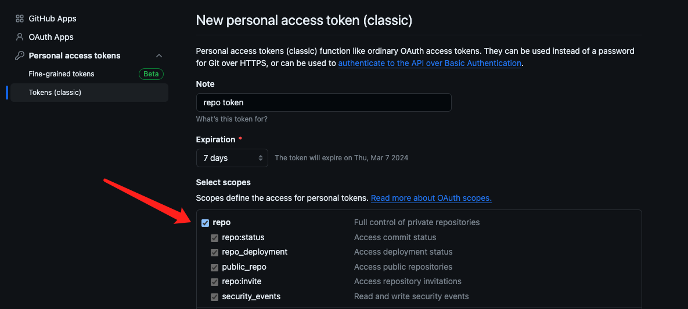
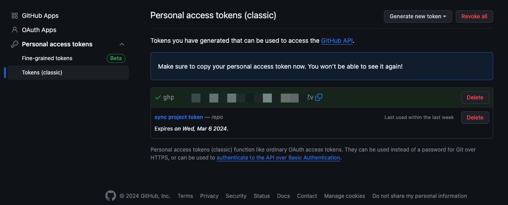

同步目录下 git 项目到 github，实现自动化创建仓库，自动化上传

<!--more-->

---

## 0. 预先准备

1. Github Token

   打开[GitHub Token New](https://github.com/settings/tokens/new)页面，勾选`repo`​ 选项，如下图所示

   ​​

   拉至页面最下面，生成 Token，最后复制该 Token，保存好

   ​​

2. 切换分支

   把需要同步的 git 项目迁移到同一个文件夹内，并且把这些项目的 git 分支使用`git checkout [branch]`​ 命令切换到开发的主分支上，并且保证暂存区无修改内容。

## 1. 代码

在需要同步的目录下，新建一个 shell 文件，名为`sync_git_project.sh`​，代码内容如下：

```shell
#!/bin/bash

user='' # 填入github用户名
github_token='' # 填入上一步生成的token

# 遍历文件夹下的目录
for file in *
do
    file_path=`pwd`
    dir_name="$file_path/$file"

    # 判断是否为目录
    if test -d $dir_name; then
        # 是否为git项目
        if test -d "$dir_name/.git"; then
            echo $file
            cd $file
            git stash
            git pull
            # 创建远程私有github仓库
            # API：https://docs.github.com/zh/rest/repos/repos?apiVersion=2022-11-28#create-a-repository-for-the-authenticated-user
            if ! git remote -v | grep git@github.com:$user/$file.git; then
                curl -L -s \
                -X POST \
                -H "Accept: application/vnd.github+json" \
                -H "Authorization: Bearer $github_token" \
                -H "X-GitHub-Api-Version: 2022-11-28" \
                https://api.github.com/user/repos \
                -d "{\"name\":\"$file\",\"private\":true}" \
                --compressed
                # 添加remote
                git remote set-url --add origin git@github.com:$user/$file.git
            fi

            # 上传
            git push
            git stash pop
            echo "$file upload complete\n"
            cd ..
        fi
    fi
done
```

## 2. 运行

在终端执行下面的命令，即可同步项目至 github

```bash
bash sync_git_project.sh
```

等待一段时间后，可以发现目录内的 git 项目已全部同步至 github，并且如果之前没有该 repo，也自动创建了。
